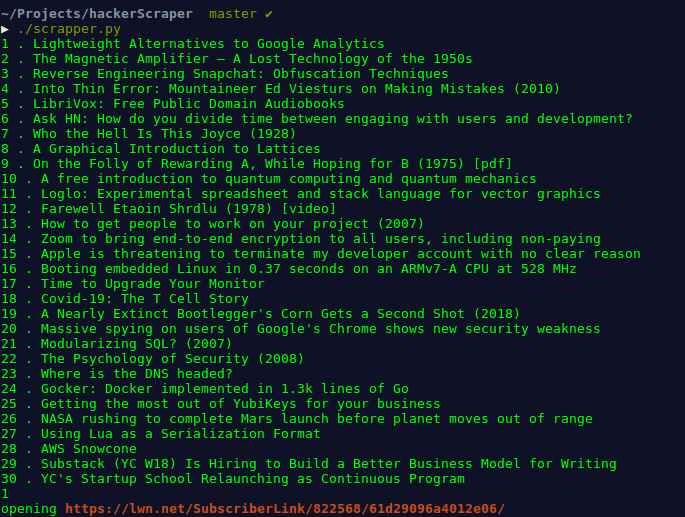

# Hacker Scraper

A python script to list the top hacker news articles in your terminal, and open whichever you want to read in the browser.




## Setup

1. Clone the [repository][repository link].
2. Install the dependencies given below.
3. Run script `./scrapper.py`.

## Dependencies

```

pip install beautifulsoup==4.6.0
pip install termcolor==1.1.0

```

[repository link]: https://www.github.com/c0dzilla/hackerScraper
